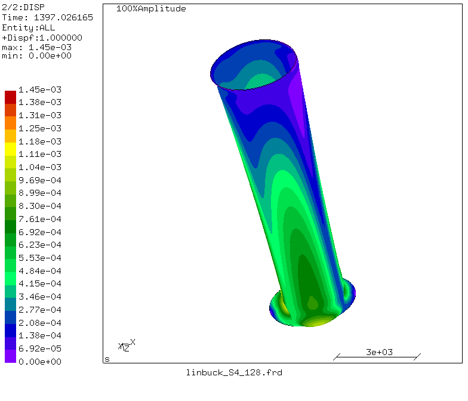
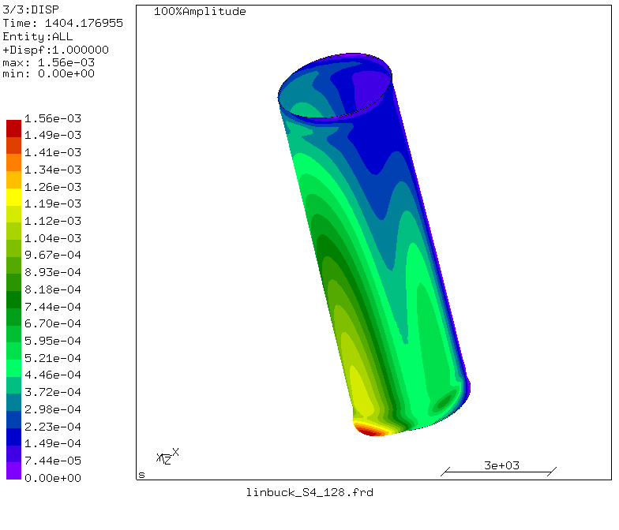
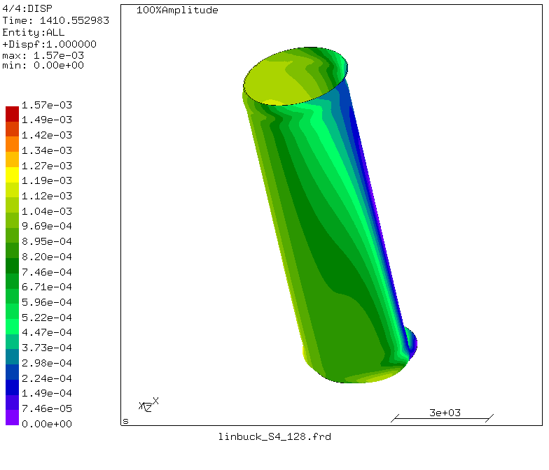
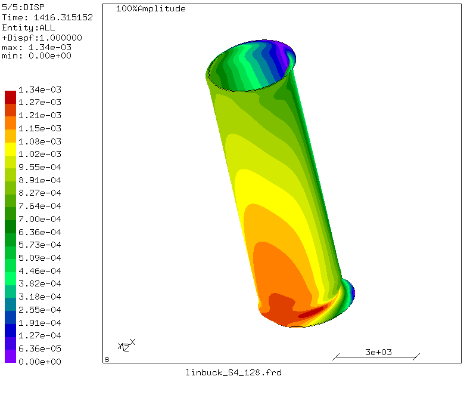
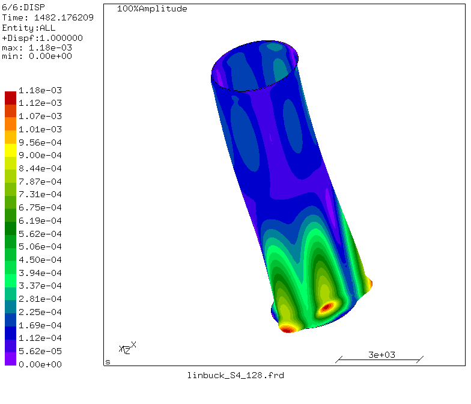
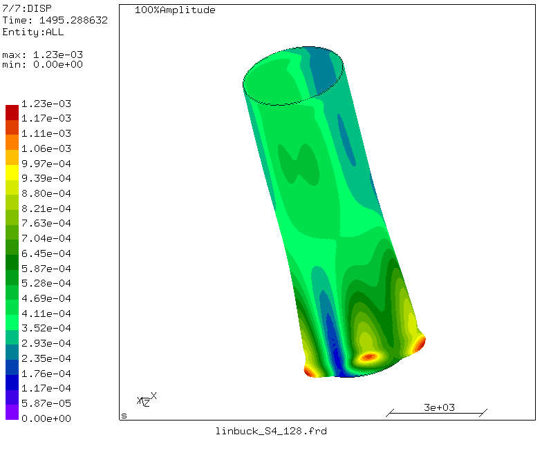
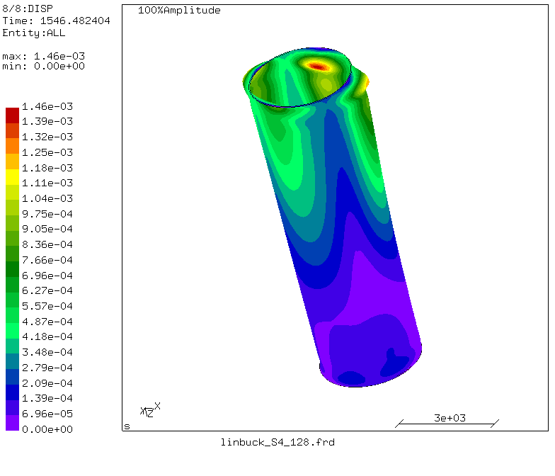
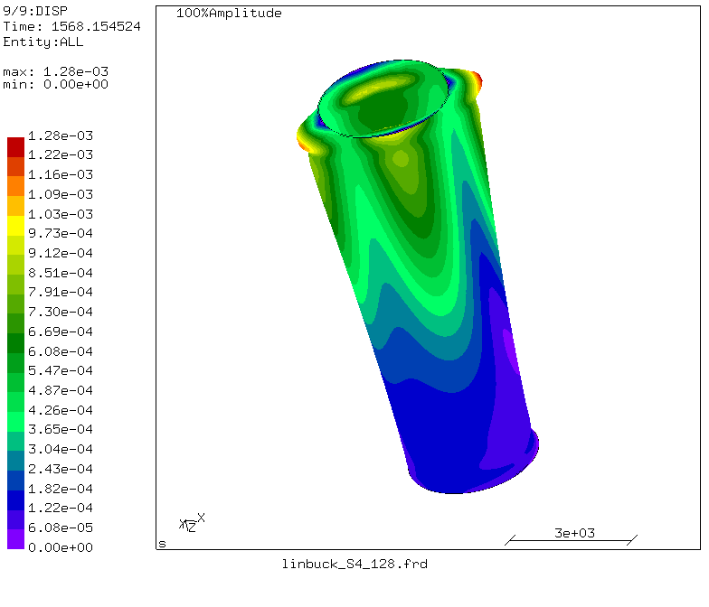
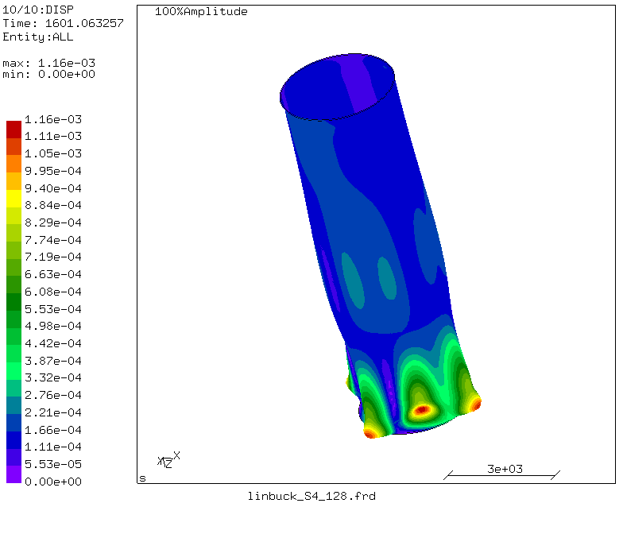
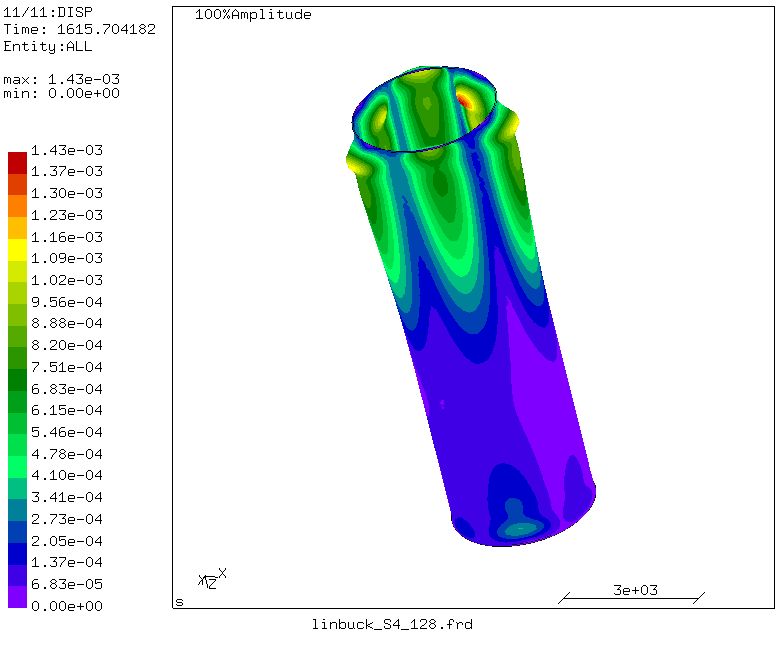

* Comparison of Shell Element Types for Linear Buckling Analysis
buckling mode geometry factors
m stands for the number of axial half waves in the mode
n stands for the number of circumferential full waves

** Buckling Mode Results for S4
model rotated in 105 degrees
Mode 1| n= 2, m= 1/2

Mode 2| n= 2 m= 1/2

Mode 3| n= 2 m= 1/2

Mode 4| n= 2 m= 1/2

Mode 5| n= 3 m= 1/2

Mode 6| n= 3 m= 1/2

Mode 7| n= 2 m= 1/2

Mode 8| n= 2 m= 1/2

Mode 9| n= 4 1<m<2

Mode 10| n= 3 m= 1/2

** Degenerate Modes
S4, mode 9  & S8, mode 10

-> case study: when two nodes are similar in a particular column

S4: mode 3 and 4
n=2 and m=1/2
  

